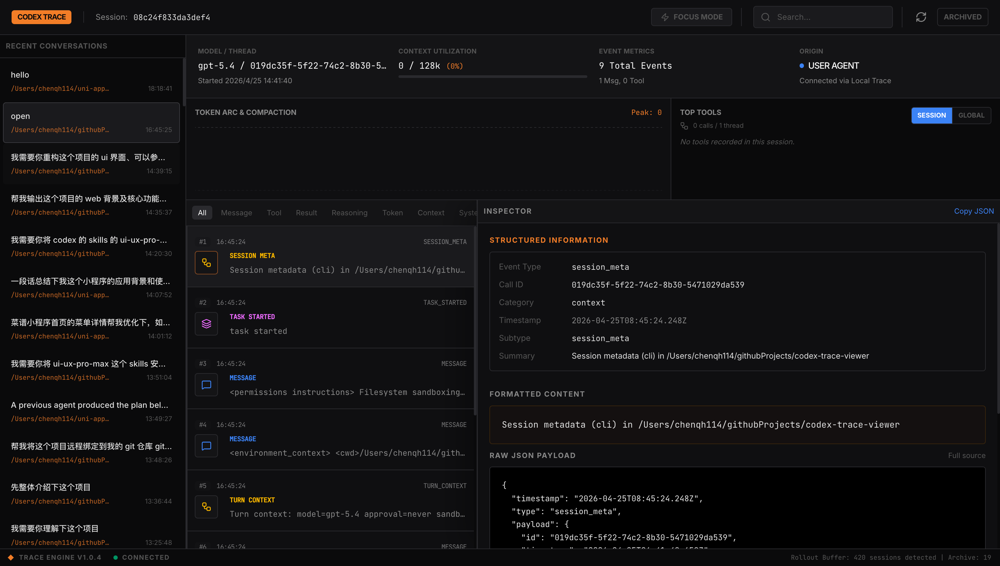

# Codex Trace Viewer

一个专业的 Web 工具，用于分析 Codex rollout traces。该应用扫描 Codex JSONL 会话文件，构建会话摘要，解析事件时间线，并通过直观的 React UI 提供全面的 token/工具/轮次分析。

[English Documentation](./README.md) | [架构文档](./ARCHITECTURE.md)

## 界面截图



界面采用三栏布局，包含会话列表、事件时间线和详细的事件检查器。

## 功能特性

- **会话管理**：浏览和搜索活跃及归档的 Codex 会话
- **事件时间线**：可视化会话事件，支持按类别过滤（消息、工具调用、推理、token 等）
- **Token 分析**：通过交互式图表跟踪 token 使用情况，显示上下文利用率
- **工具使用分析**：分析工具调用模式，提供会话级和全局统计
- **专注模式**：无干扰视图，用于深度追踪分析
- **事件检查器**：详细的 payload 检查，包含格式化内容和原始 JSON 视图
- **实时更新**：按需刷新会话和分析数据

## 前置要求

- Node.js（推荐 v18 或更高版本）

## 安装

```bash
npm ci
```

## 使用方法

### 快速启动（推荐）

使用提供的 `run.sh` 脚本轻松启动：

```bash
# 添加执行权限（仅首次需要）
chmod +x run.sh

# 以开发模式启动（默认）
./run.sh

# 以生产模式启动
./run.sh -m prod

# 使用自定义端口
./run.sh -p 8080

# 使用自定义 Codex 主目录
./run.sh -h /path/to/.codex

# 使用自定义会话路径
./run.sh -s ./data/sessions -a ./data/archived

# 组合多个选项
./run.sh -m prod -p 8080 -h /custom/codex/path

# 显示帮助信息
./run.sh --help
```

脚本会自动：
- 检查并安装依赖（如需要）
- 在生产模式下自动构建项目
- 使用指定配置启动服务器
- 显示美观的配置信息横幅

### 手动启动

#### 开发模式

```bash
npm run dev

# 带自定义参数的开发模式
npm run dev -- --port 8080 --codex-home /path/to/.codex
```

服务器将在 `http://localhost:3000` 启动。

#### 生产模式

```bash
npm run build
npm start

# 带自定义参数的生产模式
npm start -- --port 8080 --sessions ./data/sessions --archived ./data/archived_sessions
```

### 配置

默认情况下，后端从 `~/.codex/sessions` 和 `~/.codex/archived_sessions` 读取数据。

你可以通过三种方式配置追踪源和端口：

- 推荐：使用 `run.sh` 的 `-p`、`-h`、`-s`、`-a` 等参数
- 通过 `npm run dev -- --...` 或 `npm start -- --...` 直接传递服务端参数
- 使用环境变量或 `.env` 文件

当 CLI 参数和环境变量同时存在时，CLI 参数优先级更高。

直接传递服务端参数的示例：

```bash
# 设置自定义 Codex 主目录
npm run dev -- --codex-home /path/to/.codex

# 或设置明确的会话目录
npm start -- --sessions ./data/sessions --archived ./data/archived_sessions

# 自定义端口
npm run dev -- --port 8080
```

环境变量仍然受支持：

```bash
# 设置自定义 Codex 主目录
CODEX_HOME=/path/to/.codex npm run dev

# 或设置明确的会话目录
CODEX_SESSIONS_PATH=./data/sessions CODEX_ARCHIVED_PATH=./data/archived_sessions npm run dev

# 自定义端口
PORT=8080 npm run dev
```

创建 `.env` 文件以进行持久化配置（参考 `.env.example`）：

```env
# Codex Trace Viewer 配置
# 未设置显式路径时默认为 ~/.codex
# CODEX_HOME="/Users/you/.codex"

# 当你想指向测试数据或非标准追踪位置时使用这些配置
# CODEX_SESSIONS_PATH="./data/sessions"
# CODEX_ARCHIVED_PATH="./data/archived_sessions"

# 可选：自定义端口（默认：3000）
# PORT=8080
```

## API 端点

### 兼容旧版的端点

- `GET /api/sessions` - 列出所有会话，支持可选搜索
- `GET /api/sessions/:id` - 获取包含事件的详细会话数据

### 增强的追踪 API

- `GET /api/health` - 健康检查端点
- `GET /api/bootstrap?include_archived=1` - 引导数据，可选包含归档会话
- `GET /api/tool-analytics?limit=12` - 全局工具使用分析
- `GET /api/conversations?q=keyword` - 按关键词搜索会话
- `GET /api/conversations/:id/events` - 获取会话的事件时间线
- `GET /api/conversations/:id/events/:eventIndex?full=1` - 获取详细的事件数据

## 项目结构

```
codex-trace-viewer/
├── src/
│   ├── App.tsx           # 主 React 应用
│   ├── main.tsx          # 应用入口点
│   ├── types.ts          # TypeScript 类型定义
│   └── lib/
│       └── utils.ts      # 工具函数
├── server.ts             # Express 后端服务器
├── start-server.cjs      # 加载 TypeScript 服务端的 Node 包装器
├── run.sh                # 快速启动脚本
├── data/                 # 默认数据目录
├── index.html            # HTML 模板
├── vite.config.ts        # Vite 配置
└── package.json          # 项目依赖
```

## 技术栈

- **前端**：React 19、TypeScript、Tailwind CSS、Motion（动画）、Recharts（图表）
- **后端**：Express.js、Node.js
- **构建工具**：Vite
- **UI 图标**：Lucide React

## 开发

```bash
# 安装依赖
npm ci

# 以开发模式运行完整应用
npm run dev

# 类型检查
npm run lint

# 构建生产环境前端资源
npm run build

# 以生产模式运行完整应用
npm start

# 仅预览前端静态资源（不包含后端 API）
npm run preview

# 清理构建产物
npm run clean
```

## 故障排查

### 找不到会话

如果查看器显示没有会话：
- 验证 `~/.codex/sessions` 或你的自定义 `CODEX_HOME` 路径是否存在
- 检查目录中是否包含 `.jsonl` 文件
- 确保会话文件可读（检查文件权限）

### 端口已被占用

如果端口 3000 已被占用：
```bash
./run.sh -p 8080

# 或
npm run dev -- --port 8080
```

### 会话未更新

点击页头的刷新按钮或重启开发服务器以重新加载会话数据。

## 许可证

MIT 许可证 - 详见 [LICENSE](LICENSE) 文件。

## 贡献

欢迎贡献！请随时提交 Pull Request。

对于重大更改，请先开启 issue 讨论你想要改变的内容。
